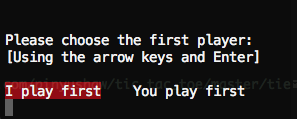
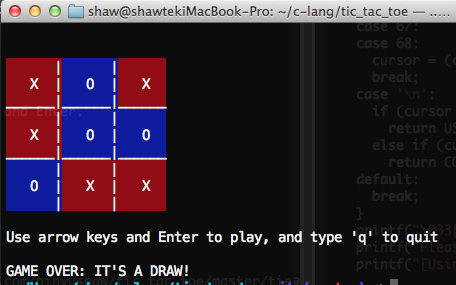

tic_tac_toe.c
======




Console version of the game "tic-tac-toe"(AI) for OS X.

### Gameplay

Play the game using the arrow keys and Enter.

### Requirements

- C compiler
- OS X

### Installation

```
wget https://raw.githubusercontent.com/pinyushaw/tic_tac_toe/master/tic_tac_toe.c
gcc -o tic_tac_toe tic_tac_toe.c
./tic_tac_toe
```

### Contributing

Contributions are very welcome.


### License

[Creative Commons](http://creativecommons.org/licenses/by-nc-sa/3.0/)
